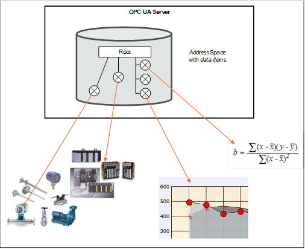

[Core](/Core)/[Part8](/Core/Part8)
## Concepts ##

Data Access deals with the representation and use of automation data in _Servers_.

Automation data can be located inside the _Server_ or on I/O cards directly connected to the _Server_. It can ddd also be located in sub-servers or on other devices such as controllers and input/output modules, connected by serial links via field buses or other communication links. OPC UA Data Access _Servers_ provide one or more OPC UA Data Access _Clients_ with transparent access to their automation data.
The links to automation data instances are called _DataItems_. Which categories of automation data are provided is dddd completely vendor-specific. [Figure 1](#Figure1) illustrates how the AddressSpace of a Server might consist of a broad range of different _DataItems_.

||
|:---:|
|<a name="Figure1"/>**Figure 1 – OPC DataItems are linked to automation data**|

_Clients_ may read or write _DataItems_, or monitor them for value changes. The _Services_ needed for these operations are specified in Part 4. Changes are defined as a change in status (quality) or a change in value that exceeds a client-defined range called a _Deadband_. To detect the value change, the difference between the current value and the last reported value is compared to the _Deadband_.
